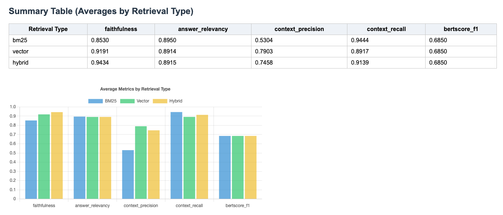
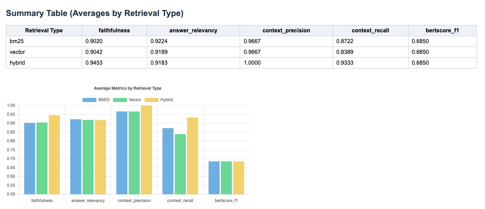

# contextual-retrieval-langchain-hybrid-search

This repository showcases contextual retrieval using hybrid search techniques (vector, BM25, and ensemble) with LangChain, OpenAI, and other modern NLP tools. It demonstrates how to process, chunk, and index PDF documents for advanced retrieval-augmented generation (RAG) workflows.

> **Note:** This project is an implementation of [Contextual Retrieval](https://www.anthropic.com/news/contextual-retrieval) as introduced by Anthropic, which combines contextual embeddings and contextual BM25 to significantly improve retrieval accuracy in RAG systems.

## Features
- **PDF Processing:** Converts PDF documents into text chunks with metadata.
- **Contextual Chunking:** Adds succinct context to each chunk using LLMs for improved retrieval.
- **Hybrid Retrieval:** Supports vector search, BM25, and ensemble retrieval methods.
- **Evaluation:** Includes metrics and evaluation using Ragas and BERTScore.
- **Jupyter Notebooks:** Step-by-step workflows in `rag.ipynb` and `tf-idf.ipynb`.

## Project Structure
```
├── pdf/         # Source PDF documents
├── chunks/      # JSON files with processed text chunks
├── rag/         # Output files from RAG experiments
├── tf-idf/      # Output files from TF-IDF/Hybrid experiments
├── rag.ipynb    # Main RAG workflow notebook
├── tf-idf.ipynb # TF-IDF and hybrid search notebook
├── LICENSE      # Apache License 2.0
```

## Installation
Install the required dependencies:
```bash
pip install --upgrade "langchain>=0.1.0" "pydantic>=2.0.0" rank_bm25 PyPDF2 ragas bert-score pandas
```

## Usage
1. **Prepare Data:** Place your PDF files in the `pdf/` directory.
2. **Run Notebooks:**
   - Open and execute `rag.ipynb` or `tf-idf.ipynb` in Jupyter.
   - The notebooks will process PDFs, chunk text, add context, and perform retrieval experiments.
3. **View Results:**
   - Outputs and evaluation metrics are saved in the `rag/` and `tf-idf/` directories.

## Frontend: Interactive RAGAS Report

You can explore the contextual retrieval evaluation results and interactively upload your own CSV files using the web frontend:

👉 [RAGAS Retrieval Evaluation Report](https://ficiverson.github.io/contextual-retrieval-langchain-hybrid-search/ragas_report.html)

- View the current results and metrics.
- Drag & drop your own output CSVs (output_bm25.csv, output_vector.csv, output_hybrid.csv) to compare and analyze your retrieval runs.

## Naive RAG vs Contextual Retrieval

This project includes a direct comparison between traditional (naive) RAG and Contextual Retrieval, following the methodology described by Anthropic. The results below show the improvements in retrieval quality and context-awareness when using contextualized chunking and retrieval.

### Visual Comparison

**Naive RAG:**



**Contextual Retrieval RAG:**



### Quantitative Results

**Contextual Retrieval RAG**

| Method   | Faithfulness | Answer Relevancy | Context Precision | Context Recall | BERTScore F1 |
|----------|--------------|------------------|-------------------|---------------|--------------|
| BM25     | 0.90         | 0.92             | 0.97              | 0.87          | 0.69         |
| Vector   | 0.90         | 0.92             | 0.97              | 0.84          | 0.69         |
| Hybrid   | 0.95         | 0.92             | 1.00              | 0.93          | 0.69         |

**Naive RAG**

| Method   | Faithfulness | Answer Relevancy | Context Precision | Context Recall | BERTScore F1 |
|----------|--------------|------------------|-------------------|---------------|--------------|
| BM25     | 0.85         | 0.90             | 0.53              | 0.94          | 0.69         |
| Vector   | 0.92         | 0.89             | 0.79              | 0.89          | 0.69         |
| Hybrid   | 0.94         | 0.89             | 0.75              | 0.91          | 0.69         |

As shown, Contextual Retrieval provides significant improvements in context precision and overall faithfulness, especially for hybrid retrieval methods.

## License
This project is licensed under the [Apache License 2.0](LICENSE).
